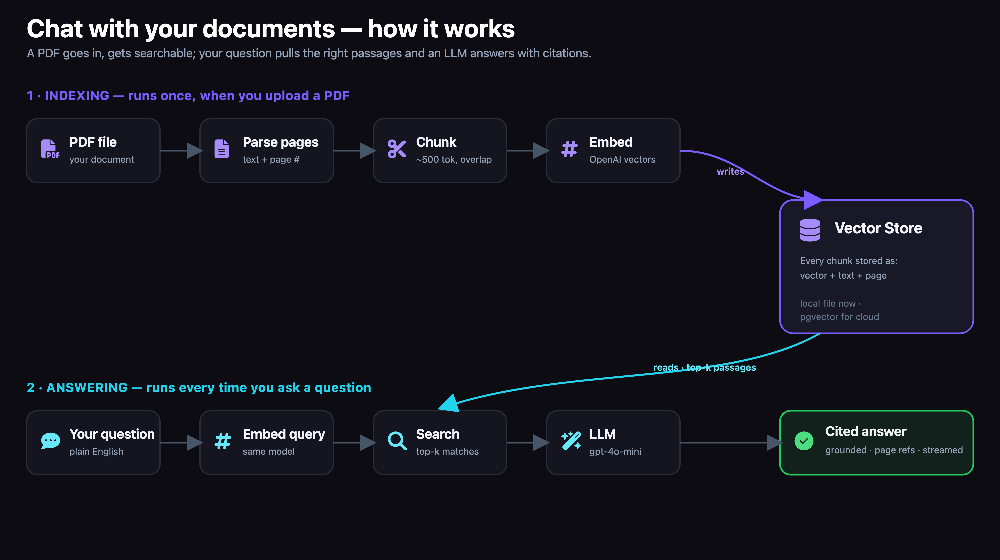
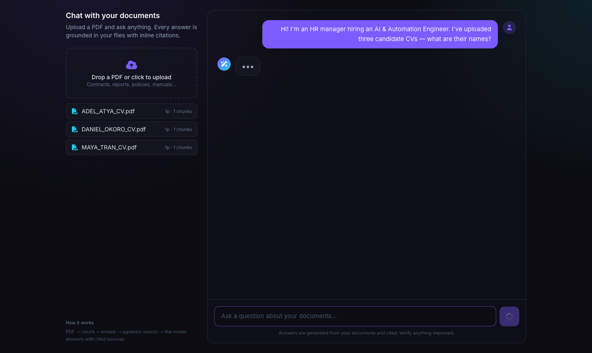
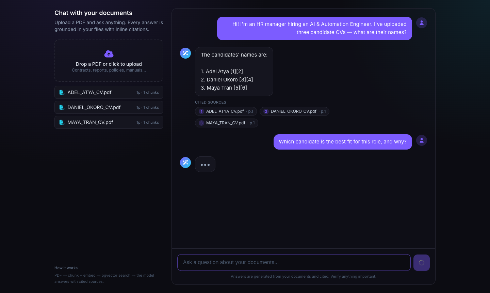
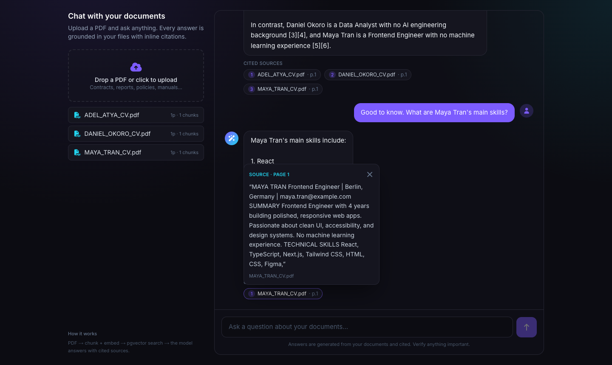

# Chat with your documents 📄

Upload PDFs → ask questions → get **answers with inline citations**, grounded in your files.

A real RAG (Retrieval-Augmented Generation) app: PDFs are parsed per page, chunked, embedded into a vector store, and answered by an LLM that cites the exact source passage and page each statement came from.

**▶️ Live demo:** https://chat-with-docs-henna.vercel.app
The hosted demo comes pre-loaded with three sample candidate CVs — try asking:
*"Who are the candidates?"* · *"Which is the best fit for an AI engineering role, and why?"*


---

## ✨ Features

- **Drag-and-drop PDF upload** with live "parsing → chunking → embedding" feedback
- **Vector search** over your documents (cosine similarity)
- **Cited answers** — every claim is grounded in retrieved chunks and shows the source passage + page number (click a citation chip to expand it)
- **Multi-document Q&A** — ask comparison questions across several files at once
- **Token-by-token streaming** chat UI
- **Runs on a single OpenAI key** — no other services required

## 🗺️ How it works



| Layer        | Tech                                            |
| ------------ | ----------------------------------------------- |
| Frontend/API | Next.js 14 (App Router) + Tailwind + Font Awesome |
| Embeddings   | OpenAI `text-embedding-3-small` (1536-dim)      |
| Generation   | OpenAI `gpt-4o-mini` (configurable)             |
| Vector store | On-disk JSON store + bundled seed (**pgvector-ready** — schema in [`supabase/schema.sql`](supabase/schema.sql)) |
| PDF parsing  | `pdf-parse` (per-page, for citations)           |

> **Vector store notes.** The app ships with a lightweight on-disk vector store so
> it runs anywhere on a single API key. A production **Supabase pgvector** schema +
> adapter is included ([`supabase/schema.sql`](supabase/schema.sql), [`lib/store.ts`](lib/store.ts))
> for multi-tenant / cloud-scale deployments — drop it in with your DB credentials.

---

## 🖼️ Screenshots

| Candidates listed (cited) | Best-fit comparison | Source citation expanded |
|---|---|---|
|  |  |  |

---

## 🚀 Run it locally

```bash
npm install
cp .env.local.example .env.local      # then add OPENAI_API_KEY
npm run dev
```

Open <http://localhost:3000>. The app starts pre-loaded with the sample CVs;
drag in your own PDF (contract, report, manual, CV…) to add it. Your uploaded
documents persist in `.data/store.json` between restarts.

There's also a static showcase at **`/demo`**.

---

## 🔧 Knobs

| Setting             | Where                                            |
| ------------------- | ------------------------------------------------ |
| Chat model          | `OPENAI_CHAT_MODEL` (default `gpt-4o-mini`)      |
| Embedding model     | `EMBEDDING_MODEL` (default `text-embedding-3-small`) |
| Chunk size / overlap| [`lib/chunk.ts`](lib/chunk.ts)                   |
| Retrieved chunks (k)| `TOP_K` in [`app/api/chat/route.ts`](app/api/chat/route.ts) |

Scanned (image-only) PDFs have no extractable text and are rejected — add an OCR
step (e.g. Tesseract) to support them.

---

## 📂 Project structure

```
app/
  api/upload/route.ts   PDF → chunks → embeddings → vector store
  api/chat/route.ts     retrieve → LLM → stream cited answer
  page.tsx              chat UI + streaming client
  demo/page.tsx         static showcase
components/             Uploader, Message, CitationChip
lib/                    pdf, chunk, embeddings, openai, store, types
data/seed-store.json    bundled pre-embedded sample documents
supabase/schema.sql     production pgvector store (optional)
```

Built as a portfolio-ready demo of a real RAG pipeline.
