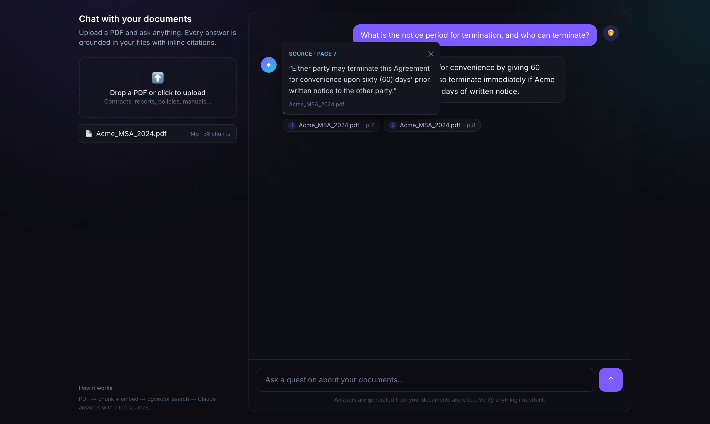

# Chat with your documents 📄✦

Upload PDFs → ask questions → get **answers with inline citations**, grounded in your files.

A real RAG (Retrieval-Augmented Generation) app: PDFs are parsed per page, chunked, embedded into a vector store, and answered by an LLM that cites the exact source passage and page each statement came from.



---

## ✨ Features

- **Drag-and-drop PDF upload** with live "parsing → chunking → embedding" feedback
- **Vector search** over your documents (cosine similarity)
- **Cited answers** — every claim is grounded in retrieved chunks and shows the source passage + page number (click a citation chip to expand it)
- **Token-by-token streaming** chat UI
- **Runs on a single OpenAI key** — no other services to set up

## 🧱 Architecture

```
PDF  ──►  parse per page  ──►  chunk (overlap)  ──►  embeddings  ──►  vector store
                                                                          │
question ──► embed ──► similarity search (top-k) ──► LLM (grounded, cited) ──► streamed answer
```

| Layer        | Tech                                            |
| ------------ | ----------------------------------------------- |
| Frontend/API | Next.js 14 (App Router) + Tailwind              |
| Embeddings   | OpenAI `text-embedding-3-small` (1536-dim)      |
| Generation   | OpenAI `gpt-4o-mini` (configurable)             |
| Vector store | Local on-disk JSON store (`.data/store.json`)   |
| PDF parsing  | `pdf-parse` (per-page, for citations)           |

> **Why a local store?** It makes the whole app run for real on `localhost` with
> zero external services. For a serverless cloud deploy, swap it for Supabase
> pgvector — see _Deploying to the cloud_ below.

---

## 🚀 Run it locally

### 1. Install
```bash
npm install
```

### 2. Add your OpenAI key
```bash
cp .env.local.example .env.local
```
Put your key in `.env.local`:
```
OPENAI_API_KEY=sk-...
```

### 3. Run
```bash
npm run dev
```
Open <http://localhost:3000>, drop in a PDF, and ask away. Uploaded documents
persist in `.data/store.json` between restarts.

There's also a **`/demo`** page (<http://localhost:3000/demo>) showing the cited-answer
UI with mock data — handy for screenshots without uploading anything.

---

## 🔧 Knobs

| Setting             | Where                                            |
| ------------------- | ------------------------------------------------ |
| Chat model          | `OPENAI_CHAT_MODEL` (default `gpt-4o-mini`)      |
| Embedding model     | `EMBEDDING_MODEL` (default `text-embedding-3-small`) |
| Chunk size / overlap| [`lib/chunk.ts`](lib/chunk.ts)                   |
| Retrieved chunks (k)| `TOP_K` in [`app/api/chat/route.ts`](app/api/chat/route.ts) |

Scanned (image-only) PDFs have no extractable text and are rejected — add an OCR
step (e.g. Tesseract) to support them.

---

## ☁️ Deploying to the cloud (optional)

The local file store is perfect for `localhost` but doesn't work on serverless
hosts (read-only filesystem). To deploy to Vercel:

1. Spin up a free Supabase project and run [`supabase/schema.sql`](supabase/schema.sql)
   (enables pgvector + creates the `match_chunks` function).
2. Replace the local-store calls in `lib/store.ts` with Supabase queries.
3. Set `OPENAI_API_KEY` (and your Supabase URL + service-role key) in the Vercel
   project's environment variables.

Want Claude instead of OpenAI for generation? It's a small swap in
[`app/api/chat/route.ts`](app/api/chat/route.ts) — add an `ANTHROPIC_API_KEY`
and use Anthropic's native citations feature.

---

## 📂 Project structure

```
app/
  api/upload/route.ts   PDF → chunks → embeddings → vector store
  api/chat/route.ts     retrieve → LLM → stream cited answer
  page.tsx              chat UI + streaming client
  demo/page.tsx         static showcase (for screenshots)
components/             Uploader, Message, CitationChip
lib/                    pdf, chunk, embeddings, openai, store, types
supabase/schema.sql     optional pgvector store for cloud deploys
```

Built as a portfolio-ready demo of a real RAG pipeline.
